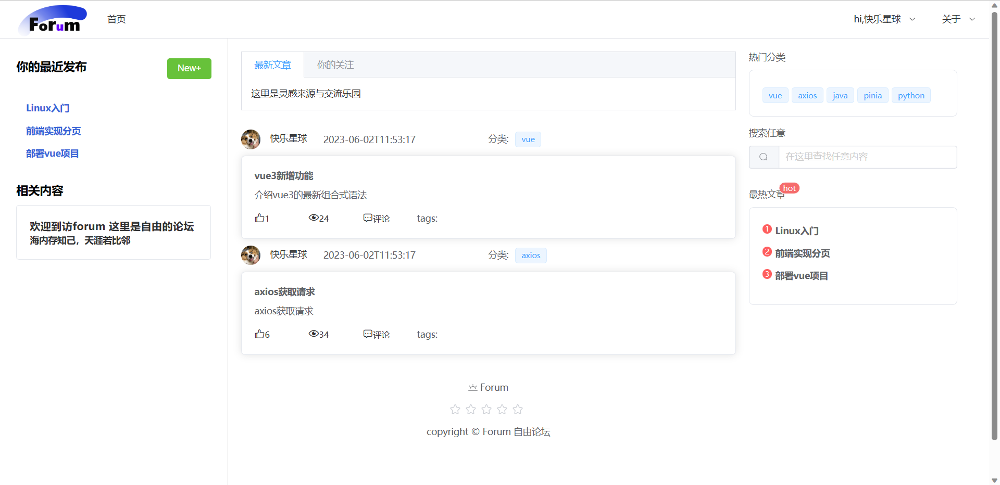
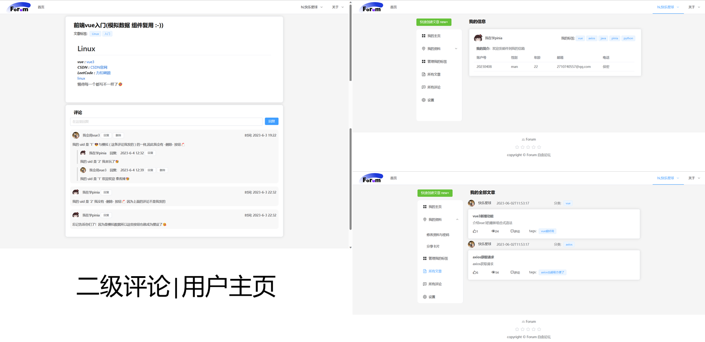
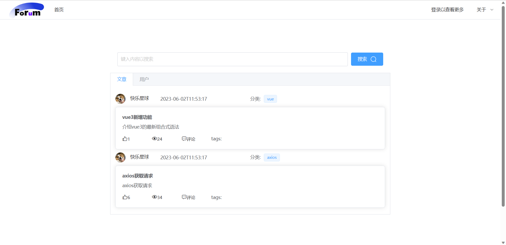
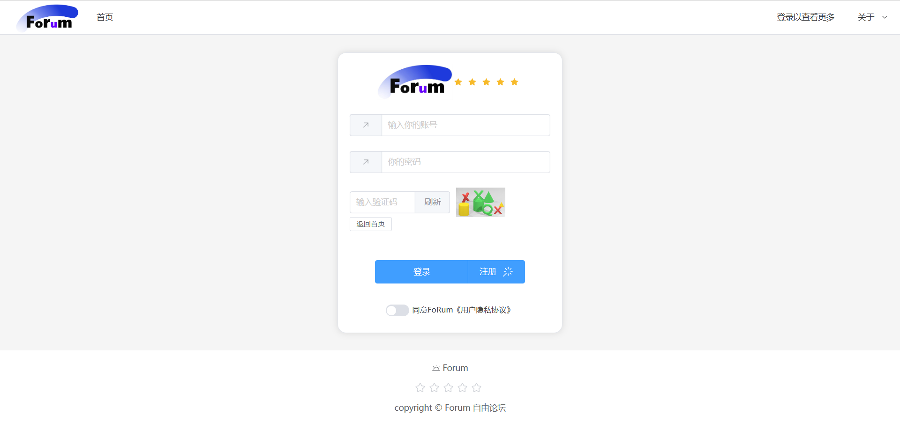
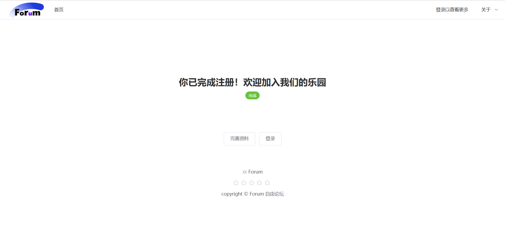

# vue3+Element ui 论坛/博客 前端实现


## 概览

*:triangular_flag_on_post: 快速的在本地**实现预览**请参考 `项目起步`小节*

*:triangular_flag_on_post: 友情链接本项目**后端开发者** 😎 [unravel-gui](https://github.com/unravel-gui/forum.git)*

**项目页面**
- 首页: 提供三栏式多功能首页
- 注册和登录：提供登录和注册页面
- 文章: 文章提供三种视图
- 评论：采用二级评论合理布局
- 搜索：提供搜索页面
- 编辑：提供文章编辑页面
- 用户: 提供用户中心页面
- 管理员: 提供管理员页面

**风格概览**

整体页面设计风格为简约设计

页面分三栏👩‍👧‍👦\两栏🧑‍🤝‍🧑\一栏⛹️

*部分页面设计参考了GitHub与LeetCode风格*

==图集== 











**文件结构**

项目使用[VSCode](https://code.visualstudio.com/)编写,使用vue脚手架初始化,`src` 目录下的文件是主要的工作区.

`views`目录下存放的是项目的主要页面

:triangular_flag_on_post:*下一标题中将详细展示*

| 文件夹                   | 说明             |
| ------------------------ | ---------------- |
| apis                     | 配置与后端的连接 |
| assets                   | 存放一些图片     |
| components               | 组件             |
| router                   | 配置路由         |
| stores                   | pinia存放数据    |
| styles                   | 前端主风格与配色 |
| utils                    | 工具类           |
| views:eye_speech_bubble: | 页面             |

**页面说明**

页面在此项目中被视为一个==组件==,*向组件传递数据的方式与方法稍后提及.*

页面的==子组件==大部分在页面的文件夹下

| 页面名                           | 对应项目文件路径                |
| -------------------------------- | ------------------------------- |
| 根页面                           | src\App.vue                     |
| 入口页面                         | src\views\Layout\index.vue      |
| 主页面:house:                    | src\views\Home\index.vue        |
| 文章主页                         | src\views\Article\index.vue     |
| 用户主页:person_with_blond_hair: | src\views\User\UserHome.vue     |
| 管理员主页                       | src\views\Admin\index.vue       |
| 搜索页面                         | src\views\Search\Search.vue     |
| 登录页面                         | src\views\Login\index.vue       |
| 注册页面                         | src\views\Register\Register.vue |
| 主组件库:book:                   | src\components                  |


## 1.项目起步

:triangular_flag_on_post: *请你浏览完 `功能实现`小节后再==开始== 首页 外的内容* ***这是因为登录的存在限制了页面跳转***

项目运行在node.js环境下 

[下载Download | Node.js (nodejs.org)](https://nodejs.org/en/download)

**安装依赖**

启动项目前需要在项目的文件夹下开启终端使用该命令安装依赖:

```shell
npm install
```

**启动项目**

```shell
npm run dev 
```

```shell
  VITE v4.3.9  ready in 4972 ms

  ➜  Local:   http://localhost:5173/
  ➜  Network: use --host to expose
  ➜  press h to show help
```

启动后在浏览器中访问此`url`即可

**依赖文件**

依赖文件在`package.json`中,已经引入了`element-plus`

## 2.可移植性与连接数据

项目主要使用[Vue3](https://cn.vuejs.org/)编写,配合使用[Pinia](https://pinia.vuejs.org/zh/)与[Element Plus](https://element-plus.org/zh-CN/)完成数据缓存与ui设计,并使用[Axios](https://www.axios-http.cn/)与后端进行数据交互.

:triangular_flag_on_post: *Axios的配置及使用将在稍后提及*

**可移植性**

所有构建数据连接的内容在本项目目中得到==屏蔽==或者==显式说明==,取代它们的是一些*人为重复的模拟数据组件*,但组件中依旧保留了必要的数据接口以便您的使用.

如果您在后端编写了相应的内容并正确配置了相应的文件,即可重新构建其数据的连接.

这其中或许需要配置一些[Vue Router](https://router.vuejs.org/zh/)和其他的关系.

**向组件传递数据**

1. **路由传参**

参数直接显示在浏览器网址栏中,通常参数是一些id或者关键信息.组件通过配置好的路由信息实现直接访问.

:triangular_flag_on_post:*下一小节将会介绍路由及其配置*

2. **vue3组件传参**

通常使用的是父传子的方式,父组件获取的数据在调用组件时得以传递

==例如== 在`src\components\article\ArticleCardFull.vue` 组件中暴露参数给父组件

```js
const props = defineProps({
  author: {
    type: Number,
    required: true
  },
  articleList: {
    type: Array,
    default: () => []
  }
});
```

父组件`src\views\Home\components\main\InfiniteArticle.vue`这样传递数据

```html
<template>
  <div>
    <ArticleCardFull :articleList="articleList" />
  </div>
</template>
```

传递数据时既可以什么也不传也可以传递部分参数.

**动态数据绑定**

使用vue`v-model`进行数据绑定

## 3.页面跳转逻辑

*页面的跳转按照是否以登录划分*

**vue路由跳转**

控制页面跳转的来自对路由的配置,这个配置文件在`src\router\index.js`,文件的格式如下:

```js
import { createRouter, createWebHistory } from 'vue-router'

// 导入组件
import Layout from '@/views/Layout/index.vue'
import Home from '@/views/Home/index.vue'

// 创建一个路由器
const router = createRouter({
  history: createWebHistory(import.meta.env.BASE_URL),
  routes: [{
    // 一级路由
    path: '/',
    component: Layout,
    // 二级路由
    children: [
      {
        path: '',
        name: 'home',
        component: Home
      }]
  }]
})

export default router
```

可以添加多个路径但请保证你所添加的组件已经导入,路由还可以有子路由.更多配置方法请参看[Vue Router](https://router.vuejs.org/zh/)指南

这里指明的路由即浏览器中访问的`url`

==例如== `http://localhost:5173/`即主页.

**在组件中指定跳转**

上述配置的文件指明了组件外的跳转,若要在组件内部跳转到指定的已配置的组件请参看下面的例子.

==例如== 在`src\views\Home\components\right\HomeRight.vue`组件中就使用了这种方式*跳转并传递搜索参数*

```js
// 导入必要的内容以使用路由
import { useRouter } from 'vue-router';
const router = useRouter();

const jumpSearch = () => {
    router.push({
        path: '/search',
        query: {
            // 传递一个搜索的文本内容
            para: input.value
        }
    })
}
```

在路由的目的地也就是`Search`组件中接收了这一参数并执行下一步操作

```js
// 导入必要的内容以使用路由
import { useRoute } from 'vue-router';
const route = useRoute()

const queryData = ref({
    query: '',
    status: false,
    type: ''
})

// 接收参数
queryData.value.query = route.query.para
```

:triangular_flag_on_post:注意两个组件内导入的内容有区别一个是`useRouter`另一个是`useRoute`

## 4.连接后端

**Axios的配置与使用**

1. **配置axios基地址**

配置文件在`src\utils\http.js`中在这里修改你的基地址以连接后端

```js
const httpInstance = axios.create({
    baseURL: 'http://你的基地址/',
    timeout: 5000
});
```

2. **编写apis文件**

在`src\apis`文件夹下编写你自己的连接后端的`js`文件

==例子:== 以get方式获取文章

```js
import httpInstance from "@/utils/http";

// 根据aid 获取文章信息
export function getArticleDetails(aid) {
    return httpInstance({
        url: `/article/${aid}`,
        method: 'get'
    });
}
```

对于每一次的请求需求在相应的文件下编写请求即可.

3. **在组件中使用**

若要在组件中使用axios获取到的信息请先引入对应的`apis`并调用函数获取请求信息.

==例子:== 在`src\views\Article\components\author\AuthorArticleMain.vue`文件中获取请求信息

```js
import { getArticleDetails } from '@/apis/article.js';
// 在组件挂载完成时执行
onMounted: {
    //接收参数
    getArticleDetails(route.query.aid).then(res => {
        console.log('作者文章页', res);
        article.value = res.data
    });
}
```

获取的数据使用vue3即可进行数据绑定与交互

## 5.功能实现

**模拟登录**

为了验证是否登录`src\stores\useAccountStore.js`文件下配置了`code`代码为999,如果您需要==免去登录==请把`code`代码改为0.

- `修改后`登录按钮将在导航栏中*被隐藏*,*将==始终处于==登录状态*

- 如果`不修改`因为没有连接后端数据,您将*一直处于未登录状态*

:triangular_flag_on_post:您可以通过修改此部分代码来模拟`登录`还是`登出`,*修改后请保存并==刷新==页面以生效*

```js
state: () => ({
    account: {
      code: 999,// 改为0
      data: {},
    },
    defaultAccount: {
      code: 999,// 改为0
      data: {},
    },
})
```

上述文件是利用`pinia`来实现数据的本地缓存,参看官方指南[定义并使用Store](https://pinia.vuejs.org/zh/core-concepts/)

在需要引入的文件中使用如下代码即可设置缓存数据

==例如:== 登陆页面`src\views\Login\index.vue`

```js
import { useAccountStore } from '@/stores/useAccountStore.js'

const accountStore = useAccountStore()
// 设置缓存数据
accountStore.setAccount(account)
```

*如果您连接了后端可以动态的设置这一参数,或者使用其他方式控制登陆状态*

**二级评论**

实现二级评论需要数据库表的支持

## 6.额外的内容

**markDown格式编辑器**

项目中使用了一款轻量但实用的md风格的编辑器,通过它来预览文章和编辑文章.

你可以点击了解更多[介绍 | v-md-editor ](https://code-farmer-i.github.io/vue-markdown-editor/zh/)

它的引入在`src\main.js`文件中

**阿里云图标库**

项目中的图标来自[iconfont-阿里巴巴矢量图标库](https://www.iconfont.cn/)

其配置在`index.html`文件中

```html
<head>
    <!-- 添加阿里图标库 -->
    <link rel="stylesheet" href="由阿里云图标库提供的url">
</head>
```

将你的css库添加在此即可
